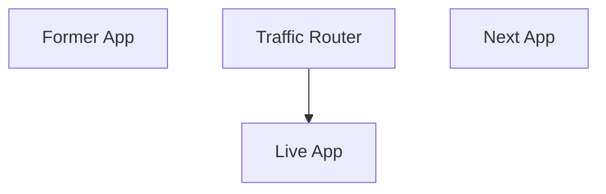

# ⚙️ Advanced Deployments

By default, SuperStack runs as a **single project** that's upgraded in place.

While this is simple, it has some trade-offs:

- Some downtime during upgrades
- No way to test a new version while another is live (blue/green)
- No quick rollback once upgraded

When your app is ready for production, you can enable a simple **traffic
router** to eliminate these issues.

## 🧭 How It Works

The traffic router is a lightweight proxy already included with SuperStack that
sits in front of your app. Its responsibilities:

- Route traffic to the correct app
- Simplify switching between versions
- Handle TLS termination



Normally the app exposes ports directly, but in this advanced mode, the **proxy
owns the ports**, and apps connect to its Docker network.

## 🔄 Tasks

1. Enable the proxy project (included in SuperStack)
1. Stop exposing ports in the app
1. Instead, connect to the proxy's Docker network
1. The proxy will listen on `:80` and `:443`

The application still manages api routes, auth, etc.

## 🧱 1. Start the Proxy

> For consistent environments, use the proxy in all environments, including
> development.

A `proxy` project already exists in your SuperStack project.

First, stop your app to release the ports:

```sh
cd app
docker compose down
```

Start the proxy:

```sh
cd ../proxy
docker compose up -d
```

## ⚙️ 2. Adjust the Application

**Remove the `ports:` from the app,** and connect it to the proxy's network by
adding these lines:

```yaml title="app/compose.yaml" hl_lines="5-15"
services:
  caddy:
    build:
      context: ./caddy
    environment:
      CADDY_SITE_ADDRESS: ":80"
    networks:
      default:
      proxy_default:
        aliases:
          - ${COMPOSE_PROJECT_NAME}_caddy

networks:
  proxy_default:
    external: true
```

Also remove the `ports:` and `CADDY_SITE_ADDRESS` in
`app/compose.override.yaml`.

What's Changed?

1. Exposed ports were removed
1. `CADDY_SITE_ADDRESS` now listens internally on port `:80`
1. The app joins the proxy's network so traffic can be routed to it
1. A container alias (`_caddy`) allows the proxy to target this service
   reliably

Bring up the app:

```sh
docker compose up -d
```

Test with:

```sh
$ curl http://localhost:8000/healthcheck
OK
```

Commit these changes – your app is now proxy-ready.

## 🚀 3. Deploying to a Remote Server

The proxy is deployed once (usually manually). After that, each app version is
deployed separately into its own directory.

1. For each deployment, bring up a new app (e.g. `app/<commit>`)
1. Test the new app while the current one remains live
1. Flip traffic in the proxy to point to the new app
1. Tear down the old one when ready

```
proxy/
  compose.yaml
app/
  a/
    compose.yaml
    .env
  b/
    compose.yaml
    .env
```

### 1. Deploy the Proxy

Before deploying, build and push your own proxy image by adding an `image:`
line to the Compose file:

```yaml title="proxy/compose.yaml" hl_lines="5"
services:
  caddy:
    build:
      context: ./caddy
    image: ghcr.io/youruser/yourapp-proxy:0.1.0
```

Build and push it:

```sh
docker compose build
docker compose push
```

Create a proxy directory on the server:

```sh
mkdir proxy
```

Copy the proxy's Compose file:

```sh
scp proxy/compose.yaml app-backend:proxy/
```

Start the proxy:

```sh
docker compose up -d
```

### 2. Deploy a new App version

Deploy your app into a new directory (e.g. `app/b/`):

> Important: Give it a unique directory name every time. Here we use 'b' for
> simplicity, but I recommend using the commit hash.

```sh
mkdir app/b
```

Copy `compose.yaml` (and secrets) there:

```sh
scp compose.yaml yourserver:app/b/
```

Start the app on the server:

```sh
cd app/b
docker compose up -d
```

Verify the new app is healthy before switching traffic:

```sh
$ docker compose exec -T caddy curl -fsS http://caddy:80/healthz
OK
```

## 🔁 4. Route Traffic

### Option 1: Use the REST API

Caddy's configuration can be adjusted via HTTP using its [REST
API](https://caddyserver.com/docs/api).

Since the app was brought up in a directory named `b`, the app's Caddy service
was given the alias `b_caddy`.

Redirect all traffic to `b_caddy`:

```sh
cd proxy
docker compose exec caddy curl -X PATCH -d '"b_caddy:80"' \
  http://localhost:2019/config/apps/http/servers/srv0/routes/0/handle/0/upstreams/0/dial
```

Traffic now points to the new stack.

### Option 2: Mount a Caddyfile

Create a simple Caddyfile on the server, such as:

```caddyfile title="proxy/caddy/Caddyfile"
{$CADDY_SITE_ADDRESS}

reverse_proxy b_caddy:80
```

Mount it into the proxy's Caddy container:

```yaml title="proxy/compose.yaml" hl_lines="4"
services:
  caddy:
    volumes:
      - ./caddy:/etc/caddy
```

Recreate the container:

```sh
cd proxy
docker compose up -d --force-recreate caddy
```

After that, to re-route traffic, simply change the app service name in
`proxy/caddy/Caddyfile` and reload the proxy's configuration:

```sh
docker compose exec caddy caddy reload --config /etc/caddy/Caddyfile
```

## ⚡ GitHub Actions Example

Add this Github Actions workflow to automate deployments:

<details>
<summary>Show full workflow</summary>

```yaml title=".github/workflows/ci.yaml"
name: Deploy

on:
  push:
    branches:
      - prod

jobs:
  deploy:
    runs-on: ubuntu-latest
    steps:
      - name: Checkout code
        uses: actions/checkout@v4

      - name: Copy compose.yaml from repository to deployment dir
        uses: appleboy/scp-action@master
        with:
          host: ${{ secrets.VPS_HOST }}
          username: ${{ secrets.VPS_USER }}
          key: ${{ secrets.VPS_SSH_KEY }}
          source: "app/compose.yaml"
          target: "app/${{ github.sha }}/"
          strip_components: 1

      - name: Deploy with Docker Compose
        uses: appleboy/ssh-action@v1.0.3
        env:
          GHCR_PAT: ${{ secrets.GHCR_PAT }}
        with:
          host: ${{ secrets.VPS_HOST }}
          username: ${{ secrets.VPS_USER }}
          key: ${{ secrets.VPS_SSH_KEY }}
          envs: GHCR_PAT
          script: |
            set -euo pipefail
            cp .env app/${{ github.sha }}/
            cd app/${{ github.sha }}

            # Pull images
            echo "$GHCR_PAT" | docker login ghcr.io --username "${{ github.actor }}" --password-stdin
            DOCKER_CLIENT_TIMEOUT=300 COMPOSE_HTTP_TIMEOUT=300 docker compose pull --quiet

            # Bring up stack and run healthchecks
            trap 'docker compose down' ERR
            docker compose up --detach
            docker compose exec -T caddy curl -fsS http://caddy:80/healthz
            # Add more healthchecks here
            # docker compose exec -T caddy curl -fsS http://api:8080/healthz
            # docker compose exec -T caddy curl -fsS http://postgrest:3000/

      - name: Flip traffic
        uses: appleboy/ssh-action@v1.0.3
        with:
          host: ${{ secrets.VPS_HOST }}
          username: ${{ secrets.VPS_USER }}
          key: ${{ secrets.VPS_SSH_KEY }}
          script: |
            set -euo pipefail
            cd proxy/caddy

            # Grab the formerly-active stack so we can stop the containers later
            OLD_HASH=$(grep '^reverse_proxy' Caddyfile | awk '{print $2}' | cut -d_ -f1)

            # Flip traffic
            sed -i "s|^reverse_proxy .*:80|reverse_proxy ${{ github.sha }}_caddy:80|" Caddyfile
            docker compose exec caddy caddy reload --config /etc/caddy/Caddyfile

            # Stop the old stack
            cd ~/app/$OLD_HASH
            docker compose down

            # Add to deploy.log
            mkdir -p /var/log/sku-generator
            echo "$(date -u +"%Y-%m-%dT%H:%M:%SZ") ${{ github.sha }}" >> /var/log/sku-generator/deploy.log
```

</details>
