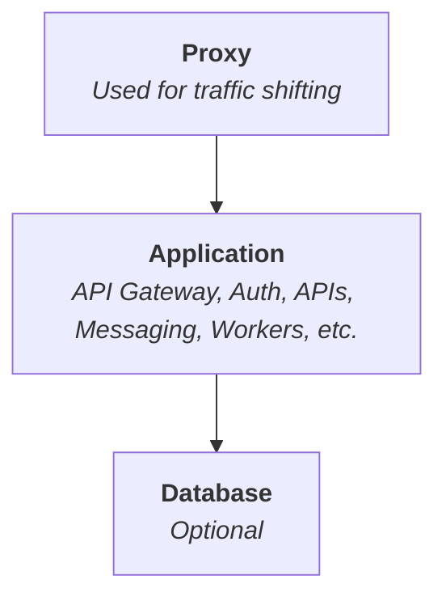

The standard SuperStack replaces the stack in place.

- There's some downtime while upgrading.
- You can't test one app while another is live (blue/green)
- Once an app is upgrade, you can't rollback.

Once your app is ready for production, consider adding a traffic-switcher in
front of your app.

Here's how it works:

- We stop exposing ports in the `app` project.
- A new `proxy` service is added, with ports open.
- It's purpose is to direct traffic to the right application. (it also takes
  over TLS termination from the app layer).
- Rather than upgrading the one app, apps are deployed separate to the live
  one. A fresh app every time.

This way, environments are _ephemeral, immutable and idempotent_.



## 1. Adjust the Application

Remove the app's exposed ports, and connect to the proxy's network:

```yaml title="app/compose.yaml" hl_lines="6-11,13-15"
services:
  caddy:
    build:
      context: ./caddy
    environment:
      CADDY_SITE_ADDRESS: ":80"
    networks:
      default:
      proxy_default:
        aliases:
          - ${COMPOSE_PROJECT_NAME}_caddy

networks:
  proxy_default:
    external: true
```

What's changed?

1. The exposed `ports` were removed.
2. Caddy's site address has changed to `:80` (The application layer no longer
   handles TLS).
3. We connect to the proxy's network, so the proxy can direct traffic to the
   app.
4. A container alias was added. This alias allows the proxy to target this
   container, while still allowing Docker to manage the container name.

Additionally, the `CADDY_SITE_ADDRESS` env var can be removed from the
development override file.

## 2. Create a new `proxy` project

From the root of the repository, create a new `proxy` project:

```sh
mkdir proxy
```

Add a compose file:

```yaml title="proxy/compose.yaml"
services:
  caddy:
    build:
      context: ./caddy
    ports:
      - "80:80"
      - "443:443"
    volumes:
      - caddy_data:/data
    environment:
      CADDY_SITE_ADDRESS: api.myapp.com

volumes:
  caddy_data:
    name: caddy-data # The proxy manages TLS, so give it a persistent volume for certificates
```

```yaml title="proxy/compose.override.yaml"
# Development overrides

services:
  caddy:
    ports:
      - "8000:80"
    environment:
      CADDY_SITE_ADDRESS: :80
```

```yaml title="proxy/caddy/Caddyfile"
{$CADDY_SITE_ADDRESS}

reverse_proxy app_caddy:80
```

## Deployment

The directory structure looks like:

```
proxy/
  compose.yaml
app/
  a/
    compose.yaml
    .env
  b/
    compose.yaml
    .env
```

## Deploy the Proxy

The proxy is only deployed once.

On the server, create a proxy directory:

```sh
mkdir proxy
```

Back on local, copy your Compose file to the server:

```sh
scp proxy/compose.yaml app-backend:proxy/
```

> You might also point a second hostname to an idle stack for testing.

## Deploy the app

```sh
docker compose up -d
```

## Flip traffic

```sh
cd proxy
docker compose exec caddy curl -X PATCH -d '"newapp_caddy:80"' \
  http://localhost:2019/config/apps/http/servers/srv0/routes/0/handle/0/upstreams/0/dial
```

## Github Actions Workflow

```yaml title=".github/workflows/ci.yaml"
name: Deploy

on:
  push:
    branches:
      - prod

jobs:
  deploy:
    runs-on: ubuntu-latest
    steps:
      - name: Checkout code
        uses: actions/checkout@v4

      - name: Copy compose.yaml from repository to deployment dir
        uses: appleboy/scp-action@master
        with:
          host: ${{ secrets.VPS_HOST }}
          username: ${{ secrets.VPS_USER }}
          key: ${{ secrets.VPS_SSH_KEY }}
          source: "app/compose.yaml"
          target: "app/${{ github.sha }}/"
          strip_components: 1

      - name: Deploy with Docker Compose
        uses: appleboy/ssh-action@v1.0.3
        env:
          GHCR_PAT: ${{ secrets.GHCR_PAT }}
        with:
          host: ${{ secrets.VPS_HOST }}
          username: ${{ secrets.VPS_USER }}
          key: ${{ secrets.VPS_SSH_KEY }}
          envs: GHCR_PAT
          script: |
            set -euo pipefail
            cp .env app/${{ github.sha }}/
            cd app/${{ github.sha }}

            # Pull images
            echo "$GHCR_PAT" | docker login ghcr.io --username "${{ github.actor }}" --password-stdin
            DOCKER_CLIENT_TIMEOUT=300 COMPOSE_HTTP_TIMEOUT=300 docker compose pull --quiet

            # Bring up stack and run healthchecks
            trap 'docker compose down' ERR
            docker compose up --detach
            docker compose exec -T caddy curl -fsS http://caddy:80/healthcheck
            # Add more healthchecks here
            # docker compose exec -T caddy curl -fsS http://api:8080/healthcheck
            # docker compose exec -T caddy curl -fsS http://postgrest:3000/

      - name: Flip traffic
        uses: appleboy/ssh-action@v1.0.3
        with:
          host: ${{ secrets.VPS_HOST }}
          username: ${{ secrets.VPS_USER }}
          key: ${{ secrets.VPS_SSH_KEY }}
          script: |
            set -euo pipefail
            cd proxy/caddy

            # Grab the formerly-active stack so we can stop the containers later
            OLD_HASH=$(grep '^reverse_proxy' Caddyfile | awk '{print $2}' | cut -d_ -f1)

            # Flip traffic
            sed -i "s|^reverse_proxy .*:80|reverse_proxy ${{ github.sha }}_caddy:80|" Caddyfile
            docker compose exec caddy caddy reload --config /etc/caddy/Caddyfile

            # Stop the old stack
            cd ~/app/$OLD_HASH
            docker compose down

            # Add to deploy.log
            mkdir -p /var/log/sku-generator
            echo "$(date -u +"%Y-%m-%dT%H:%M:%SZ") ${{ github.sha }}" >> /var/log/sku-generator/deploy.log
```
