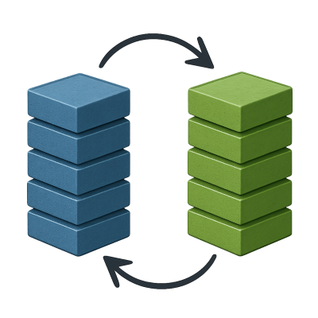

Blue/Green deployment runs two stacks side-by-side: one live, one idle. You
deploy to the idle stack, test it, and when ready, swap roles — giving
near-zero downtime and easy rollback.



## 1. Adjust the Compose file

### Remove exposed ports

We'll no longer expose ports in the stacks, instead a simple "front proxy" will
sit in front of the two stacks, exposing ports and proxying to the active
stack. So remove the Caddy service's `ports:` section in `compose.yaml`.

### Serve http-only in the stacks

Set `CADDY_SITE_ADDRESS` to only `:80` (leaving TLS termination to the front
proxy):

```yaml title="compose.yaml"
caddy:
  environment:
    CADDY_SITE_ADDRESS: :80
```

### Share volumes between the stacks

To share data between the two stacks (database, uploads, etc.), give volumes
explicit names:

```yaml title="compose.yaml"
volumes:
  postgres_data:
    name: postgres-data
  user_data:
    name: user-data
```

### Make the networks external

The front proxy needs to connect to both `blue_default` and `green_default`
networks. This makes it easier to start the front proxy regardless of whether
the stacks are up:

```yaml title="compose.yaml"
networks:
  default:
    external: true
```

In the override file, don't use external networks:

```yaml title="compose.override.yaml"
networks:
  default:
    external: false
```

Shell into the server and manually create the two networks:

```sh
docker network create blue_default
docker network create green_default
```

## 3. Add a Front Proxy

The _front proxy_ is a single container that binds ports `80` and `443` on the
server and routes requests into either the Blue or Green stack.

On the server, create a simple `Caddyfile`:

```caddyfile title="Caddyfile"
api.myapp.com {
  reverse_proxy blue_caddy:80
}
```

Optionally, point a second hostname to the idle stack for testing.

The front proxy manages TLS, so give it a persistent volume for certificates:

```sh
docker volume create caddy_data
```

Start the proxy, attaching it to both networks:

```sh
docker run -d \
  --name front-proxy \
  -p 80:80 -p 443:443 \
  -v ./Caddyfile:/etc/caddy/Caddyfile \
  -v caddy_data:/data \
  --network blue_default \
  --network green_default \
  caddy:2
```

## 4. Deploying/Upgrading

Deploying is the same as [before](deploying.md), but now we're deploying the
_idle stack_. For this example, `green` is idle so that's the one we're
deploying.

Create `blue` and `green` directories on the server and copy `compose.yaml`
into the idle stack's directory:

```sh
scp compose.yaml youruser@yourserver:green/compose.yaml
```

Shell into the server and bring up the idle stack:

```sh
cd green
docker compose pull
docker compose up -d
```

Docker will use the directory name `green` as the project name, creating
different containers, volumes and networks than the `blue` stack.

### Flip traffic

Point traffic to the `green` stack:

```caddyfile title="Caddyfile"
api.myapp.com {
  reverse_proxy green_caddy:80
}
```

Reload the front proxy's config:

```sh
docker exec front-proxy caddy reload
```

Cutover is instant. Green is now live, and Blue is the idle stack.

And rollback is simple: flip the `Caddyfile` back and `caddy reload` again.

## Github Actions

Here's a workflow for B/G deploys:

<details>
<summary>Click to expand</summary>

```yaml title=".github/workflows/ci.yaml"
name: Deploy to VPS

on:
  push:
    branches:
      - main

jobs:
  deploy:
    runs-on: ubuntu-latest
    environment: production

    steps:
      - name: Checkout code
        uses: actions/checkout@v4

      - name: Start SSH agent
        uses: webfactory/ssh-agent@v0.9.0
        with:
          ssh-private-key: ${{ secrets.VPS_SSH_KEY }}

      - name: Get the idle stack
        id: idle
        run: |
          ACTIVE=$(ssh -i ~/.ssh/id_rsa -o StrictHostKeyChecking=no \
            ${{ secrets.VPS_USER }}@${{ secrets.VPS_HOST }} \
            'cat active_stack 2>/dev/null || echo blue')

          if [ "$ACTIVE" = "blue" ]; then
            echo "IDLE=green" >> $GITHUB_OUTPUT
          else
            echo "IDLE=blue" >> $GITHUB_OUTPUT
          fi
          echo "ACTIVE=$ACTIVE" >> $GITHUB_OUTPUT

      - name: Copy compose.yaml to idle stack
        uses: appleboy/scp-action@master
        with:
          host: ${{ secrets.VPS_HOST }}
          username: ${{ secrets.VPS_USER }}
          port: 22
          key: ${{ secrets.VPS_SSH_KEY }}
          source: "compose.yaml"
          target: "${{ steps.idle.outputs.IDLE }}/"

      - name: Deploy with Docker Compose
        uses: appleboy/ssh-action@v1.0.3
        with:
          host: ${{ secrets.VPS_HOST }}
          username: ${{ secrets.VPS_USER }}
          key: ${{ secrets.VPS_SSH_KEY }}
          envs: GHCR_PAT,JWT_SECRET,POSTGRES_USER,PGUSER,POSTGRES_PASSWORD,PGPASS,PGRST_AUTHENTICATOR_PASS
          script: |
            set -euo pipefail
            echo $GHCR_PAT | docker login ghcr.io -u ${{ github.actor }} --password-stdin
            cd ${{ steps.idle.outputs.IDLE }}
            docker compose pull -q
            docker compose up -d
            echo "${{ steps.idle.outputs.ACTIVE }}" > active_stack
        env:
          GHCR_PAT: ${{ secrets.GHCR_PAT }}
          JWT_SECRET: ${{ secrets.JWT_SECRET }}
          PGRST_AUTHENTICATOR_PASS: ${{ secrets.PGRST_AUTHENTICATOR_PASS }}
          PGUSER: ${{ secrets.PGUSER }}
          PGPASS: ${{ secrets.PGPASS }}
          POSTGRES_USER: ${{ secrets.POSTGRES_USER }}
          POSTGRES_PASSWORD: ${{ secrets.POSTGRES_PASSWORD }}
```

</details>
