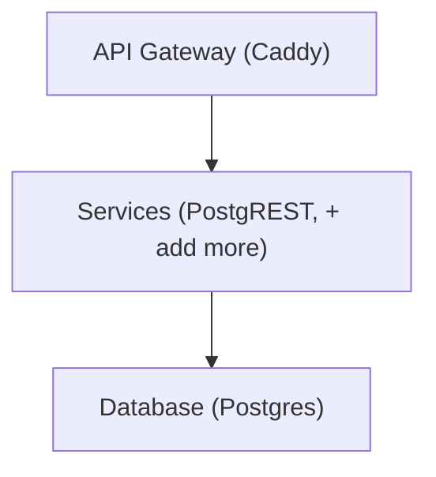

# SuperStack

Jump to:
[GitHub](https://github.com/explodinglabs/superstack) | [Developer Wiki](https://github.com/explodinglabs/superstack/wiki)

_SuperStack_ is a minimal, modular backend powered by PostgreSQL — perfect for
indie developers, SaaS builders, and teams who want full rontrol without the
bloat.

Spin up a fully working backend in seconds. Just clone, run, and start
building.

---

## 🚀 What Can I Do with SuperStack?

It's perfect for:

- 🧱 Building SaaS apps
- 💻 Running multiple stacks locally
- 📦 Easy database migrations
- 🔧 Customizing your toolchain

Everything runs inside Docker and routes through a single exposed port (via
Caddy), making it easy to develop locally or deploy remotely.

---

## 🏛️ Architecture

---

## 📚 What's next?

👉 [Getting Started](gettingstarted.md) – a guide to installing SuperStack and
launching the stack.
